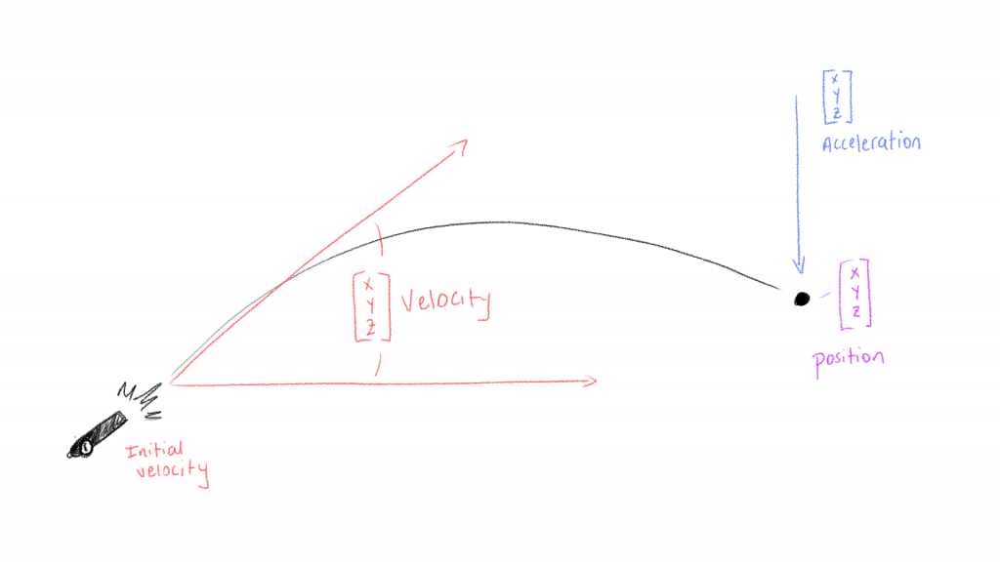
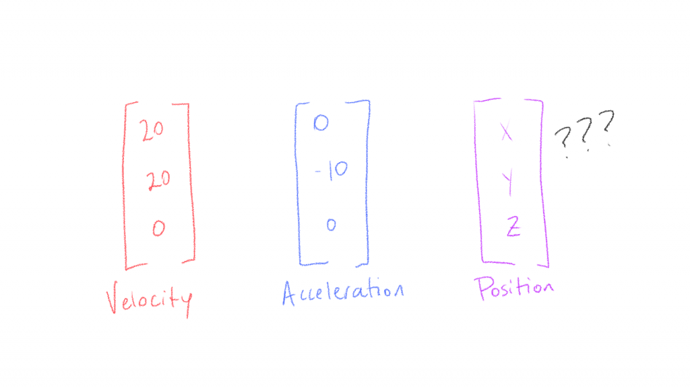

So! In the time since my first post, I've built things out a bit more and given the engine a name: Coma Physics. Comas are the clouds of gas immediately surrounding the rocky nucleus of a comet, and given that they're an integral layer of the comet's atmosphere, it makes sense to me that a physics engine, an integral layer surrounding the rocky nugget of a game's central narrative or mechanic, might derive a similar nomenclature. Plus it provides a nice segue into the core elements of the physics engine at this point: Vectors and Particles.

Talking about comets when thinking about Vectors and Particles is useful primarily because comets are always in motion (unless they collide with something), are affected by gravity, and are infinitesimally small when compared to the cosmos they inhabit. This is important for a couple reasons: 

- The position, velocity, and acceleration of the comet are our Vectors
- The comet itself is our Particle

In the case of our physics engine, a vector is a set of two, three, or more numbers that act as mathematical abstractions of things we may (or may not) experience in the real world. Because they're abstractions, they enable us to simplify and perform certain mathematical operations useful for simulating how things move in space. And the "things" we're talking about are particles. [GPED](https://developedlife.io/a-glossary-of-software-engineering-terms#gped) identifies particles as the colloquial name for a concept in physics known as the "point mass", or a point in space that has mass but no volume. While this may be a theoretical construct, and one we're not likely to interact with (unless we find ourselves in the center of a black hole maybe?), it nevertheless enables us to isolate and simplify the math we need to determine how particles move through space over time.

Let's look at an example.

Here we have a cannon firing a cannonball. I know I just talked about how great comets are, but because it's difficult to illustrate exactly WHEN a comet starts moving, I'm going to talk about cannonballs for a second. When a cannon launches a ball, or a particle, in a particular direction we have two primary forces at work: we have the firing explosion providing an initial velocity, and we have gravity providing a constant downward acceleration. The mass of the cannonball also plays a part, but that comes in later. Thinking about it in terms of the vectors themselves, they might look something like this:

If we have an initial velocity of 20m/s in both the X and Y axes (we're ignoring Z for now because the drawing is 2D), and a constant acceleration of -10m/s/s, then we can assume that the cannonball will initially leave the cannon in the direction it's pointing, and eventually fall to the ground at some time in the future and at some distance away from the cannon. For me, everything up until this point makes perfect sense. We witness things like this every day: kid throws a rock, archer shoots an arrow, player kicks a football, etc.. Where my understanding falls apart is, okay, so like.. how do I know where, on this same x/y grid, that particle is supposed to BE at any given point?

This is where all the fun math comes in, and it's this beautiful combination of linear algebra and calculus that allows us move between position, velocity, and acceleration with confidence. The reason we can move between them with confidence? They're related! Let's jump into some ideas from calculus.

Calculus as we understand it here, as in The Calculus as defined by Sir Isaac Newton, measures the instantaneous rate of change of something over a given period of time. It also measures areas under curves, but we don't have a specific need for that right now. We're primarily concerned with how things change, mathematically, over time. When we think about the position of something, unless it's a fixed object, we're interested in what that object's position is at a _given point in time_. But that usually means we have a couple pieces of information already supplied, in our case velocity and acceleration.